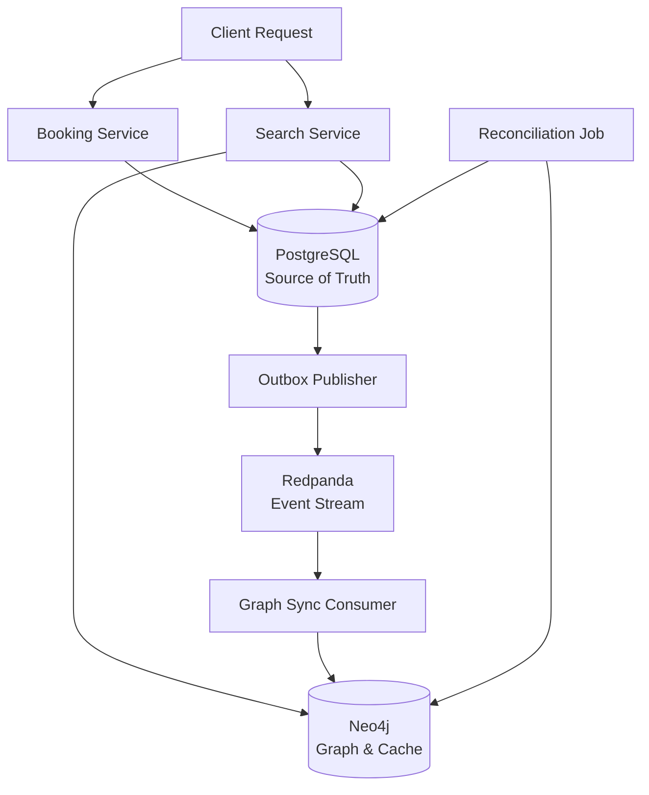

# Flight Booking System - High Level Design

## System Overview

A distributed flight booking system designed to handle ~10M Daily Active Users (DAU) with strong consistency guarantees for seat booking operations. The system supports both direct and connecting flight searches with real-time seat availability and booking capabilities.

## Core Requirements

- **Strong Consistency**: Seat booking operations must be ACID-compliant
- **Scale**: Support ~10M DAU with sub-second response times
- **Search Performance**: Flight search in 300-500ms
- **Booking Performance**: Hold/confirm operations in 500-1000ms
- **Indirect Flights**: Support for connecting flight paths (0-2 stops)
- **Seat Locking**: Temporary holds with automatic expiration

## Architecture Principles

### 1. Polyglot Persistence
- **PostgreSQL**: Source of truth for all transactional data (seats, holds, tickets)
- **Neo4j**: Graph database for flight connections and cached itineraries
- **Redpanda**: Event streaming for eventual consistency and system decoupling

### 2. Event-Driven Architecture
- **Transactional Outbox Pattern**: Guarantees reliable event publishing
- **Event Sourcing**: Track all booking state changes as events
- **CQRS**: Separate read models (Graph DB) from write models (PostgreSQL)

### 3. Strong Consistency with Eventual Consistency
- **Immediate Consistency**: All booking operations in PostgreSQL
- **Eventual Consistency**: Graph DB syncs via events for search optimization
- **Reconciliation**: Periodic jobs to ensure data consistency

## System Components

### Core Services

#### 1. Booking Service (`com.flightbooking.booking`)
- **Responsibility**: Handle seat holds, confirmations, and cancellations
- **Data Store**: PostgreSQL (primary)
- **Consistency**: Strong (ACID transactions)

#### 2. Search Service
- **Responsibility**: Flight search with itinerary caching
- **Data Stores**: PostgreSQL (itinerary cache) + Neo4j (fallback traversal)
- **Performance**: 300-500ms response time

#### 3. Event Processing
- **Outbox Publisher**: Reliable event publishing from PostgreSQL
- **Graph Sync Consumer**: Updates Neo4j from booking events
- **Message Broker**: Redpanda (Kafka-compatible)

### Data Flow Architecture



## Data Storage Strategy

### PostgreSQL (Source of Truth)
- **Flight Instances**: Scheduled flights with seat counts
- **Seats**: Individual seat inventory per flight
- **Seat Holds**: Temporary reservations with TTL
- **Tickets**: Confirmed bookings
- **Outbox Events**: Reliable event publishing queue

### Neo4j (Search Optimization)
- **Airports**: Airport metadata and connections
- **Flight Instances**: Aggregated seat counts for search
- **Itineraries**: Cached search results for performance

### Redpanda (Event Streaming)
- **Topic**: `booking.seat_events`
- **Partitioning**: By `flight_instance_id` for ordering
- **Events**: SeatBooked, SeatHoldCreated, SeatHoldReleased

## Booking Flow

### 1. Seat Hold Process
```
1. User requests seat hold
2. PostgreSQL transaction:
   - SELECT available seats (FOR UPDATE SKIP LOCKED)
   - INSERT seat_hold records (15min TTL)
   - RETURN hold confirmation
3. Emit SeatHoldCreated event (outbox)
```

### 2. Payment Confirmation
```
1. User confirms payment
2. PostgreSQL transaction:
   - Verify holds exist and not expired
   - Create ticket record
   - Convert holds to ticket_seat records
   - Update seat availability
   - Decrement flight_instance.remaining_seats
   - DELETE expired holds
   - INSERT outbox event (SeatBooked)
3. Emit SeatBooked event
4. Graph consumer updates Neo4j counts
```

### 3. Payment Failure
```
1. Explicit failure: Immediate hold release + SeatHoldReleased event
2. Async timeout: Hold expires naturally + automatic cleanup
```

## Search Strategy

### Primary Path (Fast)
1. Query PostgreSQL itinerary cache by search parameters
2. Return cached results sorted by price

### Fallback Path (Compute)
1. Neo4j graph traversal for missing itineraries:
   - Direct flights (0 stops)
   - Single connection (1 stop)
   - Double connection (2 stops)
2. Persist computed itineraries to PostgreSQL cache
3. Return results

## Monitoring & Observability

### Key Metrics
- `outbox_pending_count`: Event publishing lag
- `publisher_error_rate`: Outbox publisher failures
- `consumer_lag`: Graph sync consumer lag (per partition)
- `booking_success_rate`: Successful booking percentage
- `hold_expiry_rate`: Natural hold expiration rate
- `reconciliation_drift_count`: Data consistency issues

### Alerting Strategy
- Outbox lag > threshold: Immediate alert
- Consumer lag > threshold: Immediate alert
- Booking success rate < 95%: Alert
- Reconciliation drift > 0: Daily report

## Scalability Considerations

### Horizontal Scaling
- **Booking Service**: Stateless, scale with load
- **Outbox Publisher**: Multiple instances with FOR UPDATE SKIP LOCKED
- **Graph Consumer**: Partition-based scaling
- **Search Service**: Read replicas for Neo4j

### Performance Optimizations
- **Connection Pooling**: Database connection optimization
- **Caching**: Redis for session management
- **Indexing**: Strategic indexes on search columns
- **Partitioning**: Event streams partitioned by flight

## Security & Compliance

### Data Protection
- **Encryption**: TLS for all communications
- **PII Handling**: Secure user data storage
- **Audit Trail**: Complete booking history tracking

### Operational Security
- **Rate Limiting**: Prevent booking abuse
- **Session Management**: Secure hold management
- **Input Validation**: Comprehensive request validation

## Deployment Architecture

### Development Environment
- **Local**: Docker Compose for all services
- **Databases**: Single-node instances for development
- **Message Broker**: Single-node Redpanda

### Production Considerations
- **High Availability**: Multi-AZ deployment
- **Backup Strategy**: Automated database backups
- **Disaster Recovery**: Cross-region replication
- **Load Balancing**: Application load balancers

## Technology Stack

- **Framework**: Spring Boot 3.5.6 (Java 21)
- **Databases**: PostgreSQL 15+, Neo4j 5+
- **Message Broker**: Redpanda (Kafka-compatible)
- **Monitoring**: Micrometer + Prometheus
- **Containerization**: Docker + Kubernetes
- **CI/CD**: GitHub Actions / GitLab CI

## Success Criteria

### Performance Targets
- **Search Latency**: 300-500ms (95th percentile)
- **Booking Latency**: 500-1000ms (95th percentile)
- **Availability**: 99.9% uptime
- **Throughput**: 1000+ bookings/second

### Data Consistency
- **Strong Consistency**: 100% for booking operations
- **Eventual Consistency**: <5 minute sync lag for search
- **Reconciliation**: Zero drift tolerance
